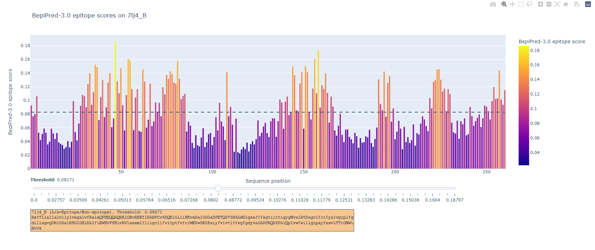

# BepiPred3.0-Predictor
BepiPred3.0 predicts B-cell epitopes from ESM1-b encodings of proteins sequences. You can you this github to setup for local installment of BepiPred-3.0.
We also provide BepiPred-3.0 is also provided as a [web service](https://biolib.com/DTU/BepiPred-3/)
## Usage
### Set up
The dependencies for the BepiPred-3.0 are listed in requirements.txt. These dependencies can be installed with pip. We used a python version 3.8.8. Other python versions may or may not be compatable with the packages listed in requirements.txt. It is recommended that you install the dependencies in a virtual environment. 
```bash
$ pip3 install -r requirements.txt
```

### Using commandline script 
A commandline script for most general use cases is provided. It takes a fasta file as input and outputs a fasta file containing B-cell epitope predictions. Output looks something like this, (capitilization=predicted epitope residue)
```bash
>7lj4_B
...QQaQRELK..
```
An example of a command from bash command line
```bash
python bepipred3_CLI.py -i ./example_antigens/example_antigens.fasta -o ./example_output/ -pred vt_pred -t 0.17 
```
This will ESM-1b encode sequences antigens.fasta, make B-cell epitope predictions at a threshold of 0.17, and store it as a fasta file in example_output.
Two ensemble models are provided, one that only uses positional ESM-1b encoding and one that also includes the sequence lengths. 
The average ensemble probability scores are also outputted in  raw_output.CSV file.
Also a fasta file with top x epitope candidate residues is outputted (by default top 10)

	
In the interface for 'output_interactive_figures.html', the x and y axis are protein sequence positions and BepiPred-3.0 epitope scores. Residues with a higher score are more likely to be part of a B-cell epitope. The threshold can be set by using the slider bar, which moves a dashed line along the y-axis. Epitope predictions are updated accordingly, and B-cell epitope predictions at the set threshold can be downloaded by clicking the button ‘Download epitope prediction’.


For more info, you can run
```bash
python bepipred3_CLI.py -h
```

### Cite
If you found BepiPred-3.0 useful in your research, please cite,

[BepiPred-3.0: Improved B-cell epitope prediction using protein language models](https://www.biorxiv.org/content/10.1101/2022.07.11.499418v1)
