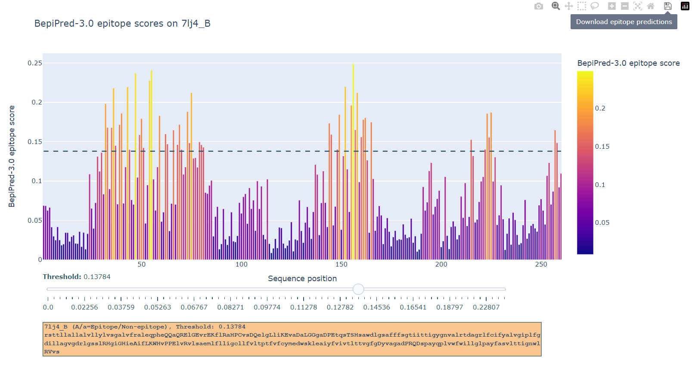
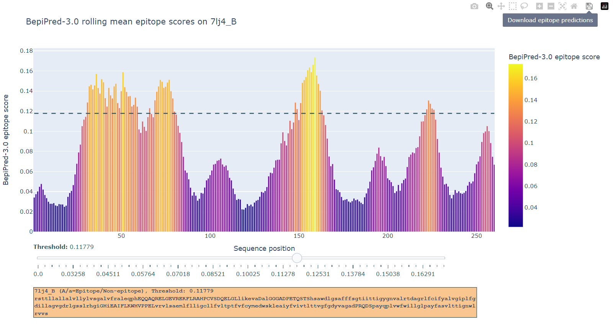

# BepiPred3.0-Predictor
BepiPred3.0 predicts B-cell epitopes from ESM-2 encodings of proteins sequences. You can you this github to setup for local installment of BepiPred-3.0.
We also provide BepiPred-3.0 is also provided as a [web service](https://services.healthtech.dtu.dk/service.php?BepiPred-3.0).
For scientific questions, please contact Joakim Clifford (joacl@dtu.dk or create an issue in the github repository).

## License
BepiPred-3.0 is developed by the Health Tech section at Technical University of Denmark (DTU). The BepiPred-3.0  code and data can be used freely by academic groups for non-commercial purposes. If you plan to use BepiPred-3.0 for any for-profit application, you are required to obtain a separate license (contact Morten Nielsen, morni@dtu.dk).

## Usage
### Set up
The dependencies for the BepiPred-3.0 are listed in requirements.txt. These dependencies can be installed with pip. We used the python version 3.8.8. Other python versions may or may not be compatable with the packages listed in requirements.txt. It is recommended that you install the dependencies in a virtual environment. 
```bash
$ pip3 install -r requirements.txt
```

### Usage
A commandline script for most general use cases is provided. It takes a fasta file as input and outputs a fasta file containing B-cell epitope predictions. Output looks something like this, (capitilization=predicted epitope residue)
```bash
>7lj4_B
...QQaQRELK..
```

The first run might take a while because the ESM-2 models need to be downloaded to your torch hub model cache, if they are not already there. 
Alternatively if you already have esm-2 models downloaded (esm2_t33_650M_UR50D.pt and esm2_t33_650M_UR50D-contact-regression.pt), you can use them directly (see bepipred3_CLI.py script)

### Inputs 

The required arguments are:

* -i fasta formatted file containing the protein sequence(s).
* -o Output directory to store B-cell epitope predictions.
* -pred {mjv_pred, vt_pred} Majorty vote ensemble prediction or variable threshold predicition on average ensemble posistive probabilities


Optional arguments are:


* -add_seq_len          Add sequence lengths to esm-encodings. Default is false.
* -esm_dir ESM_DIR      Directory to save esm encodings to. Default is current working directory.
* -t VAR_THRESHOLD      Threshold to use, when making predictions on average ensemble positive probability outputs. Default is 0.1512.
* -top TOP_CANDS        Top % candidates to display in top candidate residue output file. Default is 30%.
* -rolling_window_size  Window size to use for rolling average on B-cell epitope probability scores. Default is 9.
* -plot_linear_epitope_scores	Use linear B-cell epitope probability scores for plot. Default is false
* -z	Specify option to create zip the bepipred-3.0 results (except the interactive .html figure). Default is false.

### Outputs
A total of 5 files are generated, where epitope and non-epitope residues are indicated with uppercase and lowercase letters respectively.

- 'Bcell_epitope_preds.fasta'. Contains B-cell epitope predictions for the protein sequence(s) at the specified threshold is generated.
- 'Bcell_epitope_top_Xpct_preds.fasta'. Contains the top x pct. candidates based on BepiPred-3.0 scoring. 
- 'Bcell_linepitope_top_Xpct_preds' . Contains the top x pct. candidates based on BepiPred-3.0 linear epitope scoring.
- 'raw_output.csv'. Contains the B-cell epitope probability scores for each residue of the protein sequence(s). The rolling mean score (linear epitope score) is also provided.
- 'output_interactive_figures.html'. The optimal threshold is often protein specific. This html file can be opened in any browser and allows the user to manually set the threshold for each protein and get the the corresponding B-cell epitope predictions. By default, these graphs are generated for the first 50 proteins in the fasta file due to file size contraints.

### Example

An example of a command from linux CLI,
python bepipred3_CLI.py -i example_antigens.fasta -o ./output/ -pred vt_pred 

This will ESM-2 encode sequences in example_antigens.fasta, make B-cell epitope predictions using the default threshold. Outputs files are stored in a directory clled 'output'.

For more info, you can run,
python bepipred3_CLI.py -h

## Graphical Output: Linear and discontinous B-cell epitope prediction
In the graphical output, B-cell epitope predictions are illustrated with bar plots. The threshold for predicting B-cell epitopes is often protein-specific, and single threshold is unlikey to be optimal for all proteins. We believe this intuitive interface allows researchers to maximize their precision of B-cell epitope prediction.

### Graph output without sequential smoothing (discontinous B-cell epitope prediction)
The x and y axis are protein sequence positions and BepiPred-3.0 epitope scores.
Residues with a higher score are more likely to be part of a B-cell epitope.
The threshold can be set by using the slider, which moves a dashed line along the y-axis.
Epitope predictions are updated according to the slider.
The B-cell epitope predictions at the set threshold can be downloaded by clicking the button 'Download epitope prediction'.



### Graph output with sequential smoothing (linear B-cell epitope prediction)
If you chose to use the sequential smoothing (rolling mean) option, the graphical output will look different.
Using this option is more useful for detecting linear epitopes. But it is important to note, that some residues in the predicted linear epitope
are false positives, meaning that they do not interact directly with an antibody. This is because BepiPred-3.0 is trained on PDB crystal structures of ab-ag complexes, and to predict antigen residues that are in contact with an antibody (within 4 angstrom).


### Cite
If you found BepiPred-3.0 useful in your research, please cite,

[BepiPred-3.0: Improved B-cell epitope prediction using protein language models](https://doi.org/10.1002/pro.4497)
